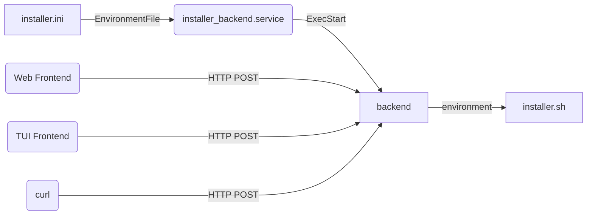

# Opinionated Debian Installer

This tool can be used to create a modern installation of Debian. 
Our opinions of what a modern installation of Debian should look like in 2025 are:

 - Debian 13 (Trixie)
 - Backports and non-free enabled
 - Firmware installed
 - Installed on btrfs subvolumes
 - Full disk encryption, unlocked by TPM
 - Fast installation using an image
 - Browser-based installer
  
## Limitations

 - **The installer will take over your whole disk**
 - Amd64 with EFI only
 - The installer is in english only

## Downloads

| Desktop environment | Download                                                                                                                                                                                                            | SHA-256 Checksum                                                        |
|---------------------|---------------------------------------------------------------------------------------------------------------------------------------------------------------------------------------------------------------------|-------------------------------------------------------------------------|
| KDE Plasma          | [opinionated-debian-installer-trixie-kde-plasma-20250810a.img (5.4GB)](https://objectstorage.eu-frankfurt-1.oraclecloud.com/n/fr2rf1wke5iq/b/public/o/opinionated-debian-installer-trixie-kde-plasma-20250810a.img) | 15ebf0b3 7846c2c3 ffe4c8f8 a6167f93 c6e57bba 5231cc8f 8bd6ba9f cc399f80 |
| Gnome               | [opinionated-debian-installer-trixie-gnome-20250811a.img (4.3GB)](https://objectstorage.eu-frankfurt-1.oraclecloud.com/n/fr2rf1wke5iq/b/public/o/opinionated-debian-installer-trixie-gnome-20250811a.img)           | 6901e643 2ef93c19 7e133434 60e765af 49c5728d 94783314 5737cc75 d6091d1a |
| Server              | [opinionated-debian-installer-trixie-server-20250602a.img (2.5GB)](https://objectstorage.eu-frankfurt-1.oraclecloud.com/n/fr2rf1wke5iq/b/public/o/opinionated-debian-installer-trixie-server-20250602a.img)         | 09fa62ec 04f3201b db5557e5 61215c70 d706be85 c0034d1f 8cff893a ee884a1a |

## Instructions

1. Download one of the live image files from the table above
2. Write the image file to a USB flash drive. **Do not use ventoy** or similar "clever" tools - they are not compatible with these images. If you need a GUI, use [etcher](https://github.com/balena-io/etcher/releases) or [win32DiskImager](https://sourceforge.net/projects/win32diskimager/files/Archive/) or just use dd - `dd if=opinionated-debian-installer*.img of=/dev/sdX bs=256M oflag=dsync status=progress` where sdX is your USB flash drive 
3. Boot from the USB flash drive
4. Start the installer icon from the desktop/dash, fill in the form in the browser and press the big _Install_ button
5. Reboot and enjoy

## Screencast & Screenshot

Screenshot of the full installer GUI:

Video of installation of Debian with KDE Plasma (Bookworm version):

## Details

- GPT disk partitions are created on the designated disk drive: 
  - UEFI ESP partition
  - Root partition - [LUKS](https://cryptsetup-team.pages.debian.net/cryptsetup/README.Debian.html) encrypted (rest of the drive)
- GPT root partition is [auto-discoverable](https://www.freedesktop.org/software/systemd/man/systemd-gpt-auto-generator.html)
- Btrfs subvolumes will be called `@` for `/`, `@home` for `/home` and `@swap` for swap (compatible with [timeshift](https://github.com/teejee2008/timeshift#supported-system-configurations)); the top-level subvolume will be mounted to `/root/btrfs1`
- The system is installed using an image from the live iso. This will speed up the installation significantly and allow off-line installation.
- [Dracut](https://github.com/dracutdevs/dracut/wiki/) is used instead of initramfs-tools
- [Systemd-boot](https://www.freedesktop.org/wiki/Software/systemd/systemd-boot/) is used instead of grub
- [Network-manager](https://wiki.debian.org/NetworkManager) is used for networking
- [Systemd-cryptenroll](https://www.freedesktop.org/software/systemd/man/systemd-cryptenroll.html#--tpm2-device=PATH) is used to unlock the disk, using TPM (if available)
- [Sudo](https://wiki.debian.org/sudo) is installed and configured for the created user 

## (Optional) Configuration, Automatic Installation

Edit [installer.ini](installer-files/boot/efi/installer.ini) on the first (vfat) partition of the installer image.
It will allow you to pre-seed and automate the installation.

If you edit it directly in the booted installer image, it is /boot/efi/installer.ini
Reboot after editing the file for the new values to take effect.

## Headless Installation

You can use the installer for server installation.

As a start, edit the configuration file installer.ini (see above), set option BACK_END_IP_ADDRESS to 0.0.0.0 and reboot the installer.
**There is no encryption or authentication in the communication so only do this on a trusted network.**

You have several options to access the installer. 
Assuming the IP address of the installed machine is 192.168.1.29 and you can reach it from your PC:

* Use the web interface in a browser on a PC - open `http://192.168.1.29/opinionated-debian-installer/`
* Use the text mode interface - start `opinionated-installer tui -baseUrl http://192.168.1.29:5000`
* Use curl - again, see the [installer.ini](installer-files/boot/efi/installer.ini) file for list of all options for the form data in -F parameters:

      curl -v -F "DISK=/dev/vda" -F "USER_PASSWORD=hunter2" \
      -F "ROOT_PASSWORD=changeme" -F "LUKS_PASSWORD=luke" \ 
      http://192.168.1.29:5000/install

* Use curl to prompt for logs:

      curl  http://192.168.1.29:5000/download_log

## Testing

If you are testing in a virtual machine, attaching the downloaded image file as a virtual disk, you need to extend it first.
The image file that you downloaded is shrunk, there is no free space left in the filesystems.
Use `truncate -s +500M opinionated*.img` to add 500MB to the virtual disk before you attach it to a virtual machine.
The installer will expand the partitions and filesystem to fill the device.

### Libvirt

To test with [libvirt](https://libvirt.org/), make sure to create the VM with UEFI:

1. Select the _Customize configuration before install_ option at the end of the new VM dialog
2. In the VM configuration window, _Overview_ tab, _Hypervisor Details_ section, select _Firmware_: _UEFI_

To add a TPM module, you need to install the [swtpm-tools](https://packages.debian.org/trixie/swtpm-tools) package.

Attach the downloaded installer image file as _Device type: Disk device_, not ~~CDROM device~~.

### Hyper-V

To test with the MS hyper-v virtualization, make sure to create your VM with [Generation 2](https://learn.microsoft.com/en-us/windows-server/virtualization/hyper-v/plan/Should-I-create-a-generation-1-or-2-virtual-machine-in-Hyper-V). 
This will enable UEFI.
TPM can be enabled and Secure Boot disabled in the Security tab of the Hyper-V settings.

You will also need to convert the installer image to VHDx format and make the file not sparse.
You can use [qemu-img](https://www.qemu.org/docs/master/tools/qemu-img.html) ([windows download](https://qemu.weilnetz.de/w64/)) and fsutil like this:

    qemu-img convert -f raw -O vhdx opinionated-debian-installer-*.img odin.vhdx
    fsutil sparse setflag odin.vhdx 0

Attach the generated VHDx file as a disk, not as a ~~CD~~.

## Hacking

Alternatively to running the whole browser based GUI, you can run the `installer.sh` script manually from a root shell.
The end result will be exactly the same.
Just don't forget to edit the configuration options (especially the `DISK` variable) before running it.

### Creating Your Own Installer Image

 1. Insert a blank storage device
 2. Edit the **DISK** and other variables at the top of `make_image.sh`
 3. Execute  `make_image.sh` as root

In the first stage of image generation, you will get a _tasksel_ prompt where you can select a different set of packages for your image.

### Installer Image Structure

There are two GPT partitions on the installer image: EFI boot partition and a Btrfs partition.  
The Btrfs filesystem is created in two phases.

In the first phase, a basic, neutral debian installation is created by debootstrap, tasksel.
At this point, a snapshot called **opinionated_installer_bootstrap** is created.
When installing the target system, the installer will detect the snapshot and copy its contents to the target root subvolume using btrfs send/receive.

In the second phase, all the installer specific files are added to the installer Btrfs filesystem.
Obviously, these are not part of the target installed system.

### Building the Front-End

The front-end is a [vue](https://vuejs.org/) application. 
You need [npm](https://www.npmjs.com/) to build it.
Run the following commands to build it:

    cd frontend
    npm run build

### Building the HTTP Backend and the Text-User-Interface Frontend

The HTTP backend and TUI frontend is a [go](https://go.dev/) application.
Run the following commands to build it:

    cd backend
    go build -o opinionated-installer

### Configuration Flow

### Output Flow

## Comparison

The following table contains comparison of features between our opinionated debian installer and official debian installers.

| Feature                                             | ODIN  | [Netinstall](https://www.debian.org/CD/netinst/) | [Calamares](https://get.debian.org/debian-cd/current-live/amd64/iso-hybrid/) |
|-----------------------------------------------------|-------|--------------------------------------------------|------------------------------------------------------------------------------|
| Installer internationalization                      | N     | Y                                                | Y                                                                            |
| Mirror selection, HTTP proxy support                | N     | Y                                                | N                                                                            |
| Manual disk partitioning, LVM, filesystem selection | N[4]  | Y                                                | Y                                                                            |
| Btrfs subvolumes                                    | Y[2]  | Y[3]                                             | Y[2]                                                                         |
| Full drive encryption                               | **Y** | Y[1]                                             | Y                                                                            |
| Passwordless unlock (TPM)                           | **Y** | N                                                | N                                                                            |
| Image-based installation                            | **Y** | N                                                | N                                                                            |
| Non-free and backports                              | **Y** | N                                                | N                                                                            |
| Browser-based installer                             | **Y** | N                                                | N                                                                            |

[1] `/boot` needs a separate unencrypted partition

[2] `@` and `@home` ([timeshift](https://github.com/linuxmint/timeshift#supported-system-configurations) compatible)

[3] `@rootfs`

[4] Fixed partitioning (see Details above), LUKS is automatic, BTRFS is used as filesystem
