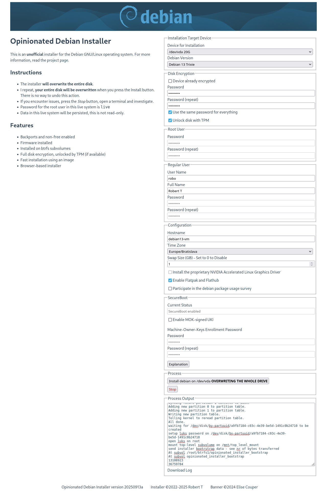

# Opinionated Debian Installer

This tool can be used to create a modern installation of Debian. Our opinions of what a modern installation of Debian should look like in 2023 are as follows:

 - Backports and non-free enabled
 - Firmware installed
 - Installed on btrfs subvolumes
 - Full disk encryption using luks2, unlocked by TPM (if available)
 - Fast installation using an image
 - Browser-based installer
  
## Limitations

 - **The installer will take over your whole disk**
 - Bookworm (debian 12) only
 - Amd64 with EFI only
 - The installer is in english only

## Downloads

| Desktop environment | Download                                                                                                                                                                                                        | SHA-256 Checksum                                                        |
|---------------------|-----------------------------------------------------------------------------------------------------------------------------------------------------------------------------------------------------------------|-------------------------------------------------------------------------|
| KDE Plasma          | [opinionated-debian-installer-bookworm-kde-plasma-20230413a.img](https://objectstorage.eu-frankfurt-1.oraclecloud.com/n/fr2rf1wke5iq/b/public/o/opinionated-debian-installer-bookworm-kde-plasma-20230413a.img) | 4b4655d7 4deb83fa 86149046 4b7b5516 ce1bc392 15271082 50a971d1 e1f4323b |
| Gnome               | [opinionated-debian-installer-bookworm-gnome-20230325a.img](https://objectstorage.eu-frankfurt-1.oraclecloud.com/n/fr2rf1wke5iq/b/public/o/opinionated-debian-installer-bookworm-gnome-20230325a.img)           | df318311 c3a38d08 ca344bfa f1e39330 1c73ab9d 713c6363 4ab9f6c9 6474f898 |

## Instructions

1. Download a live image
2. Write the image to a USB flash drive and boot it
3. Connect to the internet 
4. Start the installer icon from the desktop/dash, fill in the form in the browser and press the big _Install_ button
5. Reboot and enjoy

## Screenshots

## Details

- GPT disk partitions are created on the designated disk drive: 
  - UEFI ESP partition
  - Optional swap partition - LUKS encrypted
  - Root partition - [LUKS](https://cryptsetup-team.pages.debian.net/cryptsetup/README.Debian.html) encrypted (rest of the drive)
- GPT root partition is [auto-discoverable](https://www.freedesktop.org/software/systemd/man/systemd-gpt-auto-generator.html)
- Btrfs subvolumes will be called `@` for `/` (marked as default) and `@home` for `/home`, the top-level subvolume will be mounted to `/root/btrfs1`
- The system is installed using an image from the live iso. This will speed up the installation significantly.
- [Dracut](https://github.com/dracutdevs/dracut/wiki/) is used instead of initramfs-tools
- [Systemd-boot](https://www.freedesktop.org/wiki/Software/systemd/systemd-boot/) is used instead of grub
- [Network-manager](https://wiki.debian.org/NetworkManager) is used for networking
- [Systemd-cryptenroll](https://www.freedesktop.org/software/systemd/man/systemd-cryptenroll.html#--tpm2-device=PATH) is used to unlock the disk, using TPM (if available)

## Testing

### Libvirt

To test with [libvirt](https://libvirt.org/), make sure to create the VM with UEFI:

1. Select the _Customize configuration before install_ option at the end of the new VM dialog
2. In the VM configuration window, _Overview_ tab, _Hypervisor Details_ section, select _Firmware_: _UEFI_

To add a TPM module, you need to install the [swtpm-tools](https://packages.debian.org/bullseye-backports/swtpm-tools) package (available in bullseye-backports).

Attach the downloaded installer image file as _Device type: Disk device_, not ~~CDROM device~~.

### Hyper-V

To test with the MS hyper-v virtualization, make sure to create your VM with [Generation 2](https://learn.microsoft.com/en-us/windows-server/virtualization/hyper-v/plan/Should-I-create-a-generation-1-or-2-virtual-machine-in-Hyper-V). 
This will enable UEFI.
TPM can be enabled and Secure Boot disabled in the Security tab of the Hyper-V settings.

You will also need to convert the installer image to VHDx format and make the file not sparse.
You can use [qemu-img](https://www.qemu.org/docs/master/tools/qemu-img.html) ([windows download](https://qemu.weilnetz.de/w64/)) and fsutil like this:

    qemu-img convert -f raw -O vhdx opinionated-debian-installer-bookworm-kde-plasma-20230319a.img odin.vhdx
    fsutil sparse setflag odin.vhdx 0

Attach the generated VHDx file as a disk, not as a ~~CD~~.

## Hacking

Alternatively to running the whole browser based GUI, you can run the `installer.sh` script manually from a root shell.
The end result will be exactly the same.
Just don't forget to edit the configuration options (especially the `DISK` variable) before running it.

### Creating Your Own Installer Image

 1. Insert a blank storage device
 2. Edit the **DISK** variable at the top of files `make_image_*.sh`
 3. Execute the `make_image_*.sh` files as root

In the first stage of image generation, you will get a _tasksel_ prompt where you can select a different set of packages for your image.

### Installer Image Structure

There are 3 GPT partitions on the installer image:

 1. EFI boot partition
 2. Base Image - Btrfs partition with maximum zstd compression. 
    When the live system is running, this is used as a [read-only lower device for overlayfs](https://docs.kernel.org/filesystems/overlayfs.html). 
    When installing the target system, the installer will copy this to the target system, mount it read-write, resize to expand to the whole partition and continue with the system installation.
 3. Top Overlay - upper and work device for the overlayfs for the live system. The changes you make while the live system is running are persisted here.

### Building the Front-End

The front-end is a [vue](https://vuejs.org/) application. 
You need [npm](https://www.npmjs.com/) to build it.
Run the following commands to build it:

    cd frontend
    npm run build

## Comparison

The following table contains comparison of features between our opinionated debian installer and official debian installers.

* Netinstall - https://www.debian.org/devel/debian-installer/
* Calamares - ?

| Feature                                             | ODIN  | Netinstall | Calamares |
|-----------------------------------------------------|-------|------------|-----------|
| Installer internationalization                      | N     | Y          |           |
| Mirror selection                                    | N     | Y          |           |
| HTTP proxy support                                  | N     | Y          |           |
| Manual disk partitioning, LVM, filesystem selection | N[4]  | Y          |           |
| Btrfs subvolumes                                    | Y[2]  | Y[3]       |           |
| LUKS                                                | **Y** | Y[1]       |           |
| Image-based installation                            | **Y** | N          |           |
| Non-free and backports                              | **Y** | N          |           |
| Browser-based installer                             | Y     | N          |           |

[1] /boot needs a separate unencrypted partition

[2] @ and @home - [timeshift](https://github.com/teejee2008/timeshift#supported-system-configurations) compatible

[3] @rootfs

[4] Fixed partitioning (see Details above), LUKS is automatic, BTRFS is used as filesystem
